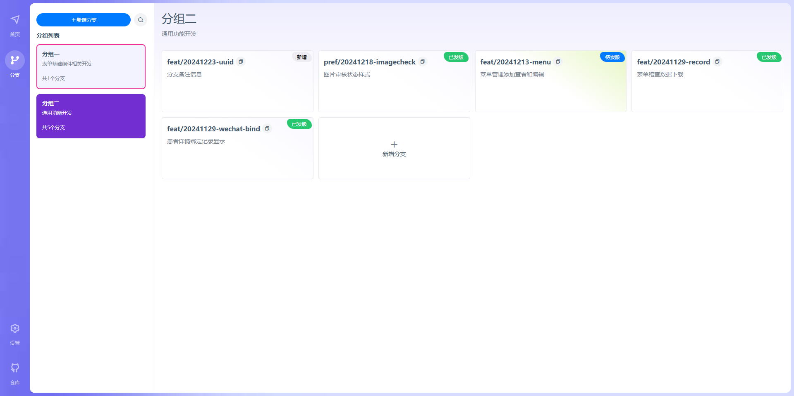

[](https://bram.cli.life)

---

因开发分支太多记不清每个分支的状态？于是手搓了这个分支管理小能手！
[](https://bram.cli.life)

## 技术栈

1. 使用[sveltekit](https://svelte.dev)全栈开发
2. 自实现session组件管理登录状态(不依赖第三方缓存)
3. 数据库ORM使用[prisma](https://prisma.io) + SQLite

## 实现功能

1. 分组管理
  - 分组标记颜色
  - 分组名称和说明信息
  - 分组新增、搜索、删除、编辑
2. 分支管理
  - 分支基础信息（所属分组、名称、备注、预计发版日期、颜色标签、分支状态）
  - 分支新增、搜索、删除、编辑、变更状态
3. 用户管理
  - 登录、注册、个人资料展示、改密、退出

## 规划中功能
1. 用户管理
2. 字典管理
3. 笔记管理
3. 分支导出（PDF,MD,Excel）

## 本地预览

```bash
# 设置环境变量
# 数据库文件默认存储在 prisma/dev.db
# 修改 SESSION_SECRET 长度为16个字符
cp .env.example .env

# 安装依赖
npm install

# 生成数据库文件
npm run deploy

# 启动开发环境
npm run dev

# 浏览器访问 http://localhost:6040
# 第1个注册账号为管理员账号


## 部署

# 打包
npm run build

